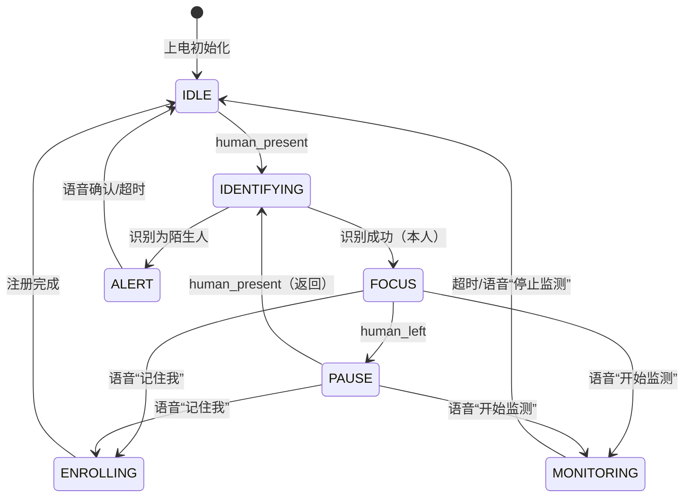

# ESP32-P4 AIoT 伴学终端 — 完整产品功能设计文档（含 Re-ID）

> 版本：v2.0  
> 日期：2026-07-04  
> 目标硬件：ESP32-P4-Function-EV-Board  
> 目标平台：ESP-IDF v5.5.2，Windows PowerShell/MSYS2  
> 文档定位：在已有代码基础上，将**跨外观行人重识别（Re-ID）**融入产品闭环，形成可直接指导后续开发的完整功能设计，并评估剩余工作量。

---

## 1. 产品定位与核心价值

### 1.1 一句话描述

一款面向中小学生书桌场景的**边缘 AI 伴学终端**：通过摄像头、麦克风、PIR、扬声器与屏幕，实现“**看得见人、认得出谁、听得懂话、说得出建议**”的主动式学习陪伴与轻量安防。

### 1.2 核心卖点

| 卖点 | 已有能力 | Re-ID 增强后能力 |
|------|----------|------------------|
| **专注守护** | 检测在座/离座，超时提醒 | 识别“是谁在座”，累计个人专注时长 |
| **主动交互** | 语音唤醒 → ASR → VLM → TTS | 识别身份后可叫出名字、提醒个人作业 |
| **轻量安防** | PIR 触发后 VLM 对比前后帧 | 只对外来者（非注册身份）报警，降低误报 |
| **跨外观鲁棒** | 无 | 借鉴博士论文 M2Net/CAG/MVMA，换衣服/侧身/背影仍可识别 |

### 1.3 设计原则

1. **边缘优先**：Re-ID、人体检测、状态机、TTS 播放全部本地完成；云端仅用于 ASR/VLM/TTS 合成。
2. **轻量可演示**：不追求论文级精度，追求“同一人离开 5 分钟再回来能认出来”。
3. **最小改动**：复用现有 `human_detect`、`camera_capture`、`cloud_api`、`ui_manager` 组件。
4. **隐私第一**：人脸识别敏感，本项目采用**背影/轮廓/体型 Re-ID**，不上传原始图像。

---

## 2. 目标用户与典型场景

### 2.1 目标用户

- 主要用户：6~14 岁学生。
- 次要用户：家长（通过手机/语音了解学习状态）。

### 2.2 典型场景

| 场景 | 用户行为 | 系统响应 |
|------|----------|----------|
| **开始学习** | 学生坐到书桌前 | 检测到人 → Re-ID 识别身份 → 播报“欢迎回来，XXX，继续今天的数学作业吧” → 开始个人专注计时 |
| **短暂离开** | 起身去洗手间 | 标记离座，暂停计时，1 分钟后语音提醒“你已经离开一分钟了” |
| **重新入座** | 返回座位 | Re-ID 再次识别 → 恢复个人计时与 UI 状态 |
| **问问题** | 说“小乐小乐，这道题怎么做” | 唤醒 → ASR → VLM（可带画面）→ TTS 回答 |
| **开启监控** | 说“开始监测” | 保存参考帧与当前用户白名单；PIR 触发时，只有陌生人出现才上云确认并语音报警 |
| **换衣服** | 换了一件外套 | 轮廓+体型+视角分桶匹配，仍识别为本人 |

---

## 3. 系统总体架构

### 3.1 硬件架构

```text
┌─────────────────────────────────────────────────────────────┐
│                    ESP32-P4-Function-EV-Board               │
│  ┌──────────────┐  ┌──────────────┐  ┌──────────────────┐  │
│  │  SC2336      │  │  MIPI-DSI    │  │  PIR 传感器       │  │
│  │  RAW8 1024×600│  │  1024×600 LCD│  │  (人体移动红外)   │  │
│  └──────┬───────┘  └───────┬──────┘  └────────┬─────────┘  │
│         │                  │                   │            │
│  ┌──────▼──────────────────▼───────────────────▼─────────┐  │
│  │                 ISP / CSI / DMA / PSRAM                │  │
│  │   RAW8 → ISP → RGB565 → 显示缓冲 + 算法缓冲             │  │
│  └──────┬──────────────────┬──────────────────────────────┘  │
│         │                  │                                │
│  ┌──────▼──────┐    ┌──────▼──────┐    ┌─────────────────┐  │
│  │  麦克风阵列  │    │   扬声器     │    │    LED 指示灯    │  │
│  └─────────────┘    └─────────────┘    └─────────────────┘  │
│  ┌─────────────────────────────────────────────────────────┐│
│  │  ESP32-C6 协处理器（SDIO）→ Wi-Fi STA → 路由 → 云端     ││
│  │  固定 SSID: hbh / 密码: hbhhbhhbh                       ││
│  └─────────────────────────────────────────────────────────┘│
└─────────────────────────────────────────────────────────────┘
```

### 3.2 软件架构

```text
┌──────────────────────────────────────────────────────────────┐
│                        用户交互层                              │
│  语音唤醒 / ASR → VLM 问答 / TTS 播报 / LVGL UI 叠加           │
├──────────────────────────────────────────────────────────────┤
│                        业务状态机                              │
│  idle / focus / pause / monitoring / enrolling / alerting    │
├──────────────────────────────────────────────────────────────┤
│  ┌──────────────┐  ┌──────────────┐  ┌─────────────────────┐ │
│  │ human_detect │  │   reid_lite  │  │   monitor_service   │ │
│  │ (ESP-WHO)    │  │ 颜色+轮廓+体型│  │ PIR + VLM 前后帧对比 │ │
│  └──────┬───────┘  └──────┬───────┘  └──────────┬──────────┘ │
│         │                 │                      │            │
│  ┌──────▼─────────────────▼──────────────────────▼─────────┐ │
│  │                    camera_capture                         │ │
│  │         RGB565 → JPEG（供 VLM 上传）                       │ │
│  └──────────────────────────────────────────────────────────┘ │
├──────────────────────────────────────────────────────────────┤
│  ┌──────────────┐  ┌──────────────┐  ┌─────────────────────┐ │
│  │   cloud_api  │  │  ui_manager  │  │  led_controller     │ │
│  │ ASR/TTS/VLM  │  │ 状态/事件/页面 │  │ PWM 指示灯           │ │
│  └──────────────┘  └──────────────┘  └─────────────────────┘ │
├──────────────────────────────────────────────────────────────┤
│  ESP-IDF 5.5.2 / FreeRTOS / LwIP / SDIO / SPIFFS / NVS       │
└──────────────────────────────────────────────────────────────┘
```

---

## 4. 功能模块详细设计

### 4.1 多模态语音交互（已跑通）

| 环节 | 实现 | 状态 |
|------|------|------|
| 语音唤醒 | `wake_word` 组件，本地关键词唤醒 | 已集成 |
| 录音 | `audio_record(3000)`，16 kHz PCM | 已集成 |
| ASR | 百度语音识别 | 已集成 |
| 意图 | 本地关键词匹配（开始监测/停止监测） | 已集成 |
| VLM | 火山方舟视觉大模型（接入点 ID） | 已修正接入点，待验证 |
| TTS | 豆包 TTS（16 kHz PCM） | 已切换，待烧录出声验证 |
| 播放 | `audio_play_pcm`，单声道转双声道 ×2 增益 | 已集成 |

**Re-ID 增强点**：
- 识别到身份后，TTS 播报可带入名字，例如“欢迎回来，小明”。
- 注册新用户时，通过语音指令“记住我”触发 enroll 流程。

### 4.2 视觉感知链路

| 步骤 | 参数 | 说明 |
|------|------|------|
| Sensor | SC2336 | RAW8，1024×600 |
| CSI | 2 lane | 接收 RAW8 |
| ISP | 一次性 AWB + CCM | 输出 RGB565，修正绿偏 |
| 显示缓冲 | 1024×600 RGB565 | 供 MIPI-DSI LCD 扫描 |
| 算法缓冲 | 1024×600 RGB565 | 供人体检测与 Re-ID 使用 |
| JPEG 编码 | `camera_capture_jpeg()` | 对齐内存分配，供 VLM 上传 |

### 4.3 人体检测与在座状态（已集成）

- 组件：`components/human_detect/`
- 模型：`ESP-WHO PedestrianDetect`
- 输入：RGB565 整帧
- 输出：是否有人（二值）
- 状态去抖：`CONFIG_HUMAN_DETECT_ENTER_CONFIRM_FRAMES` 连续帧确认入座
- 超时离座：`CONFIG_HUMAN_DETECT_LEAVE_TIMEOUT_MS`
- 提醒：离座 60 秒语音提醒

**Re-ID 增强点**：在 `on_human_present()` 中调用 `reid_identify()`，把状态从“有人”升级为“是谁”。

### 4.4 Re-ID 身份感知模块（新增）

#### 4.4.1 设计目标

- 支持注册人数：≥ 3 人（家庭成员场景）。
- 单次识别耗时：< 100 ms。
- 每人模板存储：< 5 KB。
- 识别准确率：同一人换角度/轻微换衣 > 80%（演示级）。

#### 4.4.2 特征设计（借鉴博士论文思想）

| 特征分支 | 来源 | 维度 | 对应论文思想 |
|----------|------|------|--------------|
| **颜色** | HSV 联合直方图（上身/下身分块） | 48 | M2Net 多模态输入 |
| **轮廓/边缘** | 行人 ROI 边缘图 + 水平/垂直投影 | 32 | M2Net 轮廓模态 |
| **体型/姿态** | 头肩比、躯干高宽比、重心位置 | 16 | CAG 身份-体型解耦 |
| **视角标签** | 宽高比 + 对称性 → front/side/back | 1 | MVMA 视角分桶 |
| **合计** | — | **97** | — |

> 实际实现中，所有特征均从 RGB565 行人 ROI 手工/轻量计算，不运行深度学习推理模型，确保在 ESP32-P4 上可实时完成。

#### 4.4.3 视角估计

| 视角 | 判断条件 | 说明 |
|------|----------|------|
| front | 宽高比 0.35~0.55，左右对称性高 | 正面 |
| side | 宽高比 0.15~0.30，对称性低 | 侧面 |
| back | 宽高比 0.35~0.55，对称性低，头肩轮廓无明显面部凸起 | 背面 |

匹配时优先在同视角桶内比较，允许 `front ↔ side` 跨桶，但 `back` 单独处理。

#### 4.4.4 Gallery（模板库）

存储位置：**SPIFFS**（便于更新）或 **NVS**（更稳定）。

```c
typedef struct {
    uint8_t  identity_id;              // 1..MAX_IDENTITIES
    char     name[16];                 // 用户昵称
    uint8_t  view;                     // REID_VIEW_FRONT/SIDE/BACK
    float    feature[REID_FEATURE_DIM];// 97 维特征
    int64_t  enrolled_at;              // 注册时间戳
    uint32_t hit_count;                // 命中次数，用于模板更新
} reid_template_t;
```

- 每人最多 N 个模板（建议 6 个：正/侧/背各 2 个）。
- 注册时连续抓拍 M 帧，自动分配到对应视角桶。
- 在线更新：对高置信度匹配，按命中次数做加权平均，使模板随时间轻微自适应。

#### 4.4.5 识别流程

```text
人体检测触发 on_human_present()
        │
        ▼
  获取当前 RGB565 帧
        │
        ▼
  提取行人 ROI（复用 PedestrianDetect 结果）
        │
        ▼
  计算颜色 + 轮廓 + 体型特征
        │
        ▼
  估计视角 view
        │
        ▼
  与 Gallery 同/近视角模板比余弦距离
        │
        ▼
  ┌─────────────────────────────────────┐
  │  distance < 本人阈值  →  identity   │
  │  distance > 陌生人阈值 → STRANGER   │
  │  中间区域              → UNKNOWN    │
  └─────────────────────────────────────┘
        │
        ▼
  更新 UI / 状态机 / TTS / 监控白名单
```

#### 4.4.6 注册流程

触发方式：
1. 语音指令“记住我 / 我是 XXX”。
2. 屏幕按钮（可选）。

执行步骤：
1. 状态机进入 `STATE_ENROLLING`。
2. 系统提示“请缓慢转一圈”。
3. 在 5 秒内每隔 500 ms 抓拍一次，提取特征。
4. 按视角桶去重，保留最具代表性的 3~5 个模板。
5. 写入 SPIFFS，更新内存 Gallery。
6. 提示“已记住 XXX”。

#### 4.4.7 与现有模块融合

| 现有模块 | Re-ID 融合方式 |
|----------|----------------|
| `human_detect` | 在 `on_human_present()` 中调用 `reid_identify()` |
| `monitor_start/stop` | 启动时保存当前在场身份；PIR 触发后，若 Re-ID 为 STRANGER 才走 VLM 确认 |
| `cloud_vlm_ask` | 作为**语义 fallback**：本地置信度在灰色区间时，上传裁剪图问“是否为同一人” |
| `cloud_tts_speak` | 本人回来 → 欢迎语；陌生人 → 报警语 |
| `ui_manager` | `seat_state` 扩展为“XXX 在座 / 陌生人 / 检测中”；增加个人学习时长 |
| 状态机 | 新增 `STATE_IDENTIFYING`、`STATE_ENROLLING` |

### 4.5 监控/安防模式

已有实现：语音开启/关闭，保存参考帧，PIR 触发后 VLM 对比前后帧，有变化则语音播报。

**Re-ID 增强后流程**：

```text
monitor_start()
    │
    ├── 保存参考帧
    ├── 保存当前在场身份 whitelist_id
    │
    ▼
PIR 触发
    │
    ├── 先跑 Re-ID 识别当前人物
    │       ├── 匹配 whitelist_id → 忽略（可能是主人走动）
    │       ├── STRANGER → 继续走 VLM 前后帧对比确认
    │       └── UNKNOWN → 走 VLM 确认并提示“检测到未知人员”
    │
    ▼
  仅当确认有变化且涉及非白名单人员时才语音报警
```

收益：
- 大幅降低主人自己走动导致的误报。
- 减少云端 VLM 调用次数与费用。

### 4.6 伴学与专注度

| 功能 | 已有 | Re-ID 增强 |
|------|------|------------|
| 在座计时 | 全局 `study_seconds` | 每人独立 `study_seconds` |
| 离座提醒 | 固定语音 | 可叫出名字：“小明，你已经离开一分钟了” |
| 学习报告 | 静态摘要 | 按身份汇总今日专注时长 |
| 姿态检测 | `pose_state` 占位 | 可结合 Re-ID 做“某人低头过久”提醒 |

---

## 5. 状态机设计

### 5.1 主状态机



### 5.2 事件与动作映射

| 事件 | 来源 | 动作 |
|------|------|------|
| `HUMAN_PRESENT` | 人体检测 | 触发 Re-ID；若识别为本人，恢复个人计时 |
| `HUMAN_LEFT` | 人体检测 | 暂停计时，记录离座时长，1 分钟后提醒 |
| `IDENTITY_MATCHED` | Re-ID | 欢迎语，UI 显示名字，恢复状态 |
| `IDENTITY_STRANGER` | Re-ID | UI 显示陌生人，若处于监控模式则准备 VLM 确认 |
| `IDENTITY_UNKNOWN` | Re-ID | UI 显示检测中，低置信度可询问“你是谁” |
| `PIR_MOTION` | PIR | 仅在监控模式且非白名单时上云确认 |
| `WAKE_WORD` | 本地唤醒 | 进入 ASR → VLM → TTS 链路 |
| `ENROLL_CMD` | ASR | 进入注册流程 |

---

## 6. UI/UX 设计

### 6.1 屏幕分区

- 左侧/背景：摄像头实时画面。
- 右侧：LVGL 叠层，显示状态、表情、学习卡片。

### 6.2 状态栏字段

| 字段 | 当前值示例 | Re-ID 后示例 |
|------|------------|--------------|
| 在座状态 | 在座 / 离座 | 小明 在座 / 陌生人 / 检测中 |
| 专注时长 | 12:34 | 小明今日 12:34 |
| 姿态 | 检测中 | 坐姿端正 / 低头 |
| 风险等级 | 1 | 0~3，陌生人触发提升 |
| 网络 | Wi-Fi 图标 | 同 |
| 隐私遮罩 | 隐私模式开启 | 同 |

### 6.3 表情与语音反馈

| 场景 | 表情 | 语音示例 |
|------|------|----------|
| 本人入座 | 微笑 | “欢迎回来，小明，继续加油！” |
| 陌生人 | 惊讶/警惕 | “检测到陌生人进入学习区域。” |
| 离座提醒 | 呼唤 | “小明，你已经离开一分钟了。” |
| 注册成功 | 眨眼 | “我记住你了，小明。” |

---

## 7. 安全与隐私

1. **不上传原始图像**：VLM 仅在用户主动提问或监控陌生人确认时上传 JPEG；Re-ID 特征向量不上云。
2. **本地存储加密**：Gallery 可启用 AES-128 加密（ESP32-S4/P4 支持），防止模板被轻易读取。
3. **隐私模式**：用户可说“关闭摄像头”或按按键，关闭 ISP/停止画面预览与算法处理。
4. **数据最小化**：不存储连续视频，仅保存最近 1 张参考帧与特征向量。

---

## 8. 接口与配置（Kconfig 建议）

建议新增/调整以下配置项：

```kconfig
menu "Re-ID Lite Configuration"
    config REID_LITE_ENABLED
        bool "Enable person re-identification"
        default y

    config REID_MAX_IDENTITIES
        int "Maximum registered identities"
        default 3

    config REID_TEMPLATES_PER_IDENTITY
        int "Maximum templates per identity"
        default 6

    config REID_FEATURE_DIM
        int "Feature dimension"
        default 97

    config REID_MATCH_THRESHOLD_SELF
        int "Cosine similarity threshold for self match (%)"
        default 78

    config REID_MATCH_THRESHOLD_STRANGER
        int "Cosine similarity threshold for stranger (%)"
        default 55

    config REID_STORAGE_SPIFFS
        bool "Store gallery on SPIFFS"
        default y
endmenu
```

---

## 9. 剩余开发工作量评估

> 评估假设：1 名熟悉 ESP-IDF 与 C/C++ 的开发者全职投入；基于当前代码状态；不包含硬件改动与外壳设计。

### 9.1 剩余任务清单

| 模块 | 任务 | 工作量（人天） | 依赖 |
|------|------|----------------|------|
| **基础环境** | 解决烧录端口问题（COM9 写入超时 / 换线/换口/驱动） | 0.5~1 | 硬件 |
| | 豆包 TTS 出声验证、音量主观调试 | 0.5 | 烧录 |
| | C6 协处理 OTA/联网验证 | 0.5 | 烧录 |
| **Re-ID 核心** | 创建 `components/reid_lite/` 目录与 Kconfig | 0.5 | — |
| | 行人 ROI 裁剪与预处理（RGB565 → HSV/灰度） | 1 | camera_capture |
| | 颜色直方图特征提取 | 1 | — |
| | 边缘/轮廓特征提取 | 1.5 | — |
| | 体型/姿态特征与视角估计 | 1.5 | — |
| | 特征拼接、归一化、余弦距离匹配 | 1 | — |
| | Gallery SPIFFS 持久化（注册/加载/保存/删除） | 2 | SPIFFS |
| | 注册流程与语音命令对接 | 1.5 | wake_word/ASR/TTS |
| | 识别流程集成到 `on_human_present()` | 1 | human_detect |
| | 模板在线更新与去重策略 | 1 | Gallery |
| **业务融合** | 状态机扩展（IDENTIFYING / ENROLLING / ALERT） | 1.5 | reid_lite |
| | UI 字段扩展（名字、个人时长） | 1 | ui_manager |
| | 语音反馈个性化（欢迎、陌生人、离座） | 0.5 | TTS |
| | 监控模式白名单过滤 | 1 | monitor + reid |
| | VLM fallback（灰色置信度时上传裁剪图） | 1 | cloud_api |
| **数据与测试** | 采集 3 人 × 3 视角 × 3 次测试数据 | 1 | 硬件 |
| | 离线精度测试、阈值调优 | 2 | 测试数据 |
| | 长时间稳定性测试（离座/返回循环） | 1 | — |
| | 文档、README、演示脚本 | 1 | — |

### 9.2 工作量汇总

| 阶段 | 人天 | 说明 |
|------|------|------|
| **环境修复 + 已有链路验证** | 1.5~2 | 烧录、TTS、C6 联网 |
| **Re-ID Lite 核心实现** | 10~11 | 特征、Gallery、注册/识别 |
| **业务融合 + UI + 语音** | 5~6 | 状态机、监控白名单、UI |
| **测试调优 + 文档** | 4 | 数据采集、阈值、稳定性 |
| **合计** | **20.5~23 天** | 按每天 8 小时、单开发者估算 |

> 若 2 人并行（1 人 Re-ID 算法 + 1 人业务/UI/测试），关键路径可压缩至 **12~14 天**，但集成联调仍需 3~4 天。

### 9.3 关键路径

```text
烧录环境修复 → 豆包 TTS 验证
        │
        ▼
Re-ID 特征提取 + Gallery 持久化
        │
        ▼
注册/识别流程 + 与 human_detect 集成
        │
        ▼
状态机/UI/语音个性化 + 监控白名单
        │
        ▼
数据采集 + 阈值调优 + 稳定性测试
```

### 9.4 风险与应对

| 风险 | 影响 | 应对 |
|------|------|------|
| **Re-ID 准确率不足** | 产品卖点无法演示 | 定位为“辅助身份感知”；低置信度走 UNKNOWN 流程；离线生成合成样本增强 Gallery |
| **端侧算力不足** | 特征提取超过 100 ms | 降低分辨率/ROI；只做事件触发，不做每帧；必要时用 PIE 加速简单卷积 |
| **视角估计不准** | 侧/背面误识别 | 允许 front↔side 跨桶；back 单独阈值更宽松；多角度注册 |
| **存储写寿命** | SPIFFS 频繁写模板 | 限制写频率；NVS 做备份；模板更新用命中计数触发 |
| **隐私合规** | 家长/学校顾虑 | 明确告知不上传原始视频；提供隐私模式；数据本地加密 |
| **烧录端口持续异常** | 无法迭代 | 换 USB 线、换 USB 口、检查 C6 虚拟串口占用、必要时用 ESP-Prog |

---

## 10. 里程碑与验收标准

| 里程碑 | 目标日期（相对） | 验收标准 |
|--------|------------------|----------|
| **M1：环境恢复 + 链路出声** | 第 1~2 天 | 能稳定烧录；豆包 TTS 正常播放；C6 Wi-Fi 正常 |
| **M2：Re-ID 最小闭环** | 第 8~10 天 | 支持 1 人注册；离开后 5 分钟内返回能正确识别；准确率 > 80% |
| **M3：多用户 + 监控白名单** | 第 14~16 天 | 支持 3 人注册；监控模式下主人移动不误报；陌生人触发语音提醒 |
| **M4：产品级稳定** | 第 20~23 天 | 24 小时稳定性测试通过；文档/演示脚本齐全；跨外观（换外套）识别提升 |

---

## 11. 附录

### 11.1 当前代码清单（与功能对应）

| 文件 | 作用 |
|------|------|
| `main/mipi_isp_dsi_main.c` | 主入口、状态机、回调、Wi-Fi/CSI/ISP/UI 初始化 |
| `components/human_detect/human_detect.cpp` | ESP-WHO 人体检测任务 |
| `components/camera_capture/camera_capture.c` | RGB565 → JPEG |
| `components/cloud_api/cloud_api.c` | 百度 ASR、豆包 TTS、火山 VLM |
| `components/ui/ui_lvgl.c` | LVGL 右半边叠层、表情绘制 |
| `components/ui/include/ui_manager.h` | UI 数据模型与事件类型 |
| `components/led_controller/led_controller.c` | PWM 指示灯 |
| `docs/reid_integration_design.md` | Re-ID 初步方案 |

### 11.2 当前阻塞项

- **烧录端口**：此前 COM5 可用，当前系统仅枚举 COM8/COM9；COM9 写入超时，COM8 busy。需重新插拔或更换线缆确认可用端口。
- **TTS 出声**：代码已切换豆包 TTS，尚未完成烧录验证。
- **C6 固件烧录**：`slave_ota` 已读取 `ESPPORT` 环境变量，但同样受端口问题影响。

### 11.3 依赖云服务

- 百度 ASR
- 豆包 TTS（`openspeech.bytedance.com/api/v1/tts`）
- 火山方舟 VLM（接入点 ID：`ep-m-20260708125319-hgz79`）

---

## 12. 结论

本文档将 ESP32-P4 AIoT 伴学终端从“检测到人”升级为“识别到谁”，通过轻量 Re-ID 模块把跨外观行人重识别论文中的核心思想（多模态特征、外观-身份解耦、视角感知、数据增强）落地为边缘可运行的产品功能。

- **产品闭环**：语音交互 + 视觉感知 + Re-ID 身份记忆 + 云端 VLM/TTS + LVGL UI + 轻量安防。
- **技术路线**：手工/轻量特征 + 视角分桶 + 本地 Gallery + 离线生成增强，避免在端侧跑大型神经网络。
- **剩余工作量**：单开发者约 **20~23 天**，2 人并行可压缩至 **12~14 天**。
- **下一步**：优先修复烧录端口并验证豆包 TTS 出声，随后启动 `reid_lite` 组件开发。
