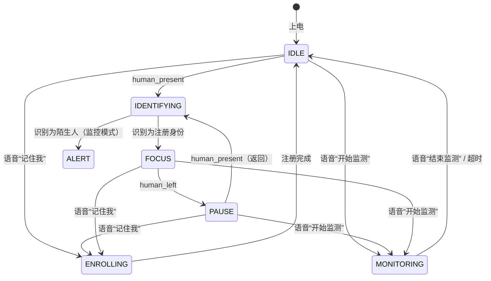

# ESP32-P4 AIoT 伴学终端 — 基于已有功能的 Re-ID 闭环产品功能设计

> 版本：v3.0（基于已有代码，剔除未实现的“问问题”等假设功能）  
> 日期：2026-07-04  
> 目标硬件：ESP32-P4-Function-EV-Board  
> 目标平台：ESP-IDF v5.5.2  
> 设计约束：**只使用当前已集成功能 + Re-ID，形成可落地的闭环**

---

## 1. 当前已集成功能（事实基线）

| 模块 | 已实现能力 | 未实现/不在本设计范围内 |
|------|------------|--------------------------|
| **视觉** | SC2336 → ISP → RGB565 1024×600；JPEG 编码供上传 | 人脸识别、姿态识别、学习画面 OCR |
| **人体检测** | ESP-WHO `PedestrianDetect`：在座/离座 + 超时 + LED 控制 | 多人同时检测与编号跟踪 |
| **语音交互** | 唤醒词 → 3 秒录音 → 百度 ASR；支持“开始监测/结束监测”指令；非指令文本可调用 VLM | **不作为“问问题”产品卖点**，仅保留命令与监控确认 |
| **监控模式** | 语音开启；保存参考帧；PIR 触发 → VLM 对比前后帧 → TTS 播报变化 | 连续录像、云端存储 |
| **TTS** | 豆包 TTS（16 kHz PCM），单声道转双声道 ×2 增益 | 待烧录出声验证 |
| **UI** | LVGL 右半边叠层：在座/离座、专注时长、风险等级、表情 | 暂不做复杂页面导航 |
| **网络** | C6 协处理器 SDIO → Wi-Fi STA（SSID `hbh`） | 无手机 App、无云端账户体系 |

> 本设计**不新增**未实现的“问问题/作业辅导/课程同步/手机 App”等功能，只把 Re-ID 嫁接到已有的人体检测与监控两条链路上，形成最小可用闭环。

---

## 2. 产品定位（精简版）

一款面向书桌场景的**边缘 AI 伴学 + 轻量安防**终端：

- **伴学**：知道“是谁在学”，记录个人专注时长，离开提醒。
- **安防**：语音开启“帮我看着”，主人进出不报警，陌生人进入才提醒。

核心体验由 **3 个闭环** 组成：

1. **入座识别闭环**（伴学）
2. **陌生人监控闭环**（安防）
3. **身份注册闭环**（初始化）

---

## 3. 三个功能闭环

### 3.1 闭环一：入座识别 + 专注陪伴

```text
学生坐到书桌前
        │
        ▼
human_detect 连续帧确认“在座”
        │
        ▼
reid_lite.identify(当前帧)
        │
        ├── 匹配注册身份（小明）
        │       ├── UI 显示“小明 在座”
        │       ├── TTS：“欢迎回来，小明，继续加油！”
        │       └── 恢复/启动 小明的专注计时
        │
        ├── 陌生人
        │       ├── UI 显示“陌生人”
        │       └── TTS（仅监控模式）：报警
        │
        └── 未知
                └── UI 显示“检测中”，继续尝试
        │
        ▼
学生起身离开
        │
        ▼
human_detect 超时确认“离座”
        │
        ▼
UI 显示“离座”，暂停该身份计时
        │
        ▼
离座 60 秒
        │
        ▼
TTS：“小明，你已经离开一分钟了，回来继续学习吧。”
        │
        ▼
学生返回
        │
        ▼
Re-ID 再次识别 → 恢复计时与状态
```

**价值**：把原来“有人/无人”的二值状态升级为“**谁在座**”，实现个人化学习时长统计。

### 3.2 闭环二：语音监控 + 陌生人过滤

```text
用户说“开始监测”
        │
        ▼
monitor_start()
        ├── 保存参考帧
        ├── 记录当前在场身份为白名单
        └── TTS：“已开始监测，有陌生人进入我会提醒你。”
        │
        ▼
PIR 检测到移动
        │
        ▼
reid_lite.identify(当前帧)
        │
        ├── 白名单身份（小明/家长）
        │       └── 忽略，不打扰
        │
        ├── 陌生人
        │       ├── VLM 对比参考帧与当前帧确认变化
        │       ├── 若确认有变化 → TTS：“检测到陌生人进入学习区域。”
        │       └── 更新参考帧
        │
        └── 未知
                └── VLM 确认后 TTS：“检测到未知人员，请确认。”
        │
        ▼
用户说“结束监测”
        │
        ▼
monitor_stop()，清除参考帧与白名单
```

**价值**：
- 解决原监控“主人自己走动也报警”的问题。
- 减少云端 VLM 调用次数，省电省流量。

### 3.3 闭环三：语音注册

```text
用户说“记住我，我叫小明”
        │
        ▼
状态机进入 ENROLLING
        │
        ▼
TTS：“请站在屏幕前，缓慢转身。”
        │
        ▼
5 秒内抓拍 5~8 帧
        │
        ▼
提取每帧的颜色+轮廓+体型特征
        │
        ▼
按 front/side/back 分桶，每桶保留最佳 1~2 个模板
        │
        ▼
写入 SPIFFS Gallery
        │
        ▼
TTS：“我记住你了，小明。”
        │
        ▼
状态机回到 IDLE
```

**价值**：设备能学习家庭成员，支撑闭环一、二中的身份识别。

---

## 4. 系统架构（与已有代码对应）

```text
┌─────────────────────────────────────────────────────────────────────┐
│                         应用层（已有）                               │
│  ┌──────────────┐  ┌──────────────┐  ┌──────────────────────────┐  │
│  │ 语音唤醒/ASR │  │  监控服务    │  │    LVGL UI / ui_manager  │  │
│  │  monitor命令 │  │ PIR+VLM对比  │  │  状态/事件/表情/专注时长  │  │
│  └──────┬───────┘  └──────┬───────┘  └───────────┬──────────────┘  │
│         │                 │                      │                  │
│         │                 │                      │                  │
│  ┌──────▼─────────────────▼──────────────────────▼──────────────┐  │
│  │                      主状态机                                 │  │
│  │  IDLE / IDENTIFYING / FOCUS / PAUSE / MONITORING / ENROLLING  │  │
│  └──────┬────────────────────────────────────────────────────────┘  │
│         │                                                           │
│  ┌──────▼──────────────┐  ┌─────────────────────┐                  │
│  │   human_detect      │  │     reid_lite       │                  │
│  │  人体在座/离座二值   │  │  颜色+轮廓+体型特征  │                  │
│  └──────────┬──────────┘  │  视角分桶+Gallery匹配 │                  │
│             │             └──────────┬──────────┘                  │
│             │                        │                              │
│  ┌──────────▼────────────────────────▼───────────────────────────┐  │
│  │                      camera_capture                            │  │
│  │              RGB565 整帧 + JPEG 编码（VLM 上传）                │  │
│  └───────────────────────────────────────────────────────────────┘  │
├─────────────────────────────────────────────────────────────────────┤
│  驱动/中间件：ESP-IDF / FreeRTOS / CSI / ISP / DSI / I2S / SDIO      │
└─────────────────────────────────────────────────────────────────────┘
```

---

## 5. Re-ID Lite 模块设计

### 5.1 输入与触发

- **输入**：人体检测任务中拿到的 RGB565 整帧 + `PedestrianDetect` 输出的行人 bbox。
- **触发时机**：仅在 `human_present` 状态变化瞬间跑一次，**不每帧运行**。
- **输出**：
  - `identity_id` + `name` + `confidence`
  - 判定标签：`REID_MATCH_SELF` / `REID_MATCH_STRANGER` / `REID_UNKNOWN`

### 5.2 特征设计

| 分支 | 计算方式 | 维度 | 作用 |
|------|----------|------|------|
| 颜色 | 行人 ROI 分上/下身，HSV 联合直方图 | 48 | 区分衣服颜色，但非唯一依赖 |
| 轮廓 | 灰度边缘图的水平/垂直投影直方图 | 32 | 对换衣服鲁棒 |
| 体型 | 头肩比、躯干高宽比、ROI 重心 | 16 | 身份稳定特征 |
| 视角 | 宽高比 + 对称性 → front/side/back | 1 | 匹配时按桶比较 |
| **合计** | — | **97** | — |

> 不运行神经网络推理，全部手工/轻量特征，单次耗时目标 < 80 ms。

### 5.3 Gallery 设计

- 存储：SPIFFS 文件 `reid_gallery.json` 或二进制 blob。
- 容量：最大 3 身份 × 6 模板 = 18 条模板。
- 每条模板约 97×4 + 元数据 ≈ 420 字节；总占用 < 8 KB。
- 结构：

```c
typedef struct {
    uint8_t  identity_id;
    char     name[16];
    uint8_t  view;                 // front/side/back
    float    feature[97];
    int64_t  enrolled_at;
    uint32_t hit_count;
} reid_template_t;
```

### 5.4 匹配策略

1. 估计当前视角 `view_cur`。
2. 只在同视角桶 + 相邻桶（front↔side）中查找最近邻。
3. 使用归一化余弦相似度：
   - `score > SELF_THRESHOLD`（如 0.78）→ 判定为本人；
   - `score < STRANGER_THRESHOLD`（如 0.55）→ 陌生人；
   - 中间 → UNKNOWN（继续观察，不播报）。
4. 对高置信度命中，做模板移动平均更新。

---

## 6. 状态机设计（简化）



---

## 7. 与现有代码的对接点

| 现有回调/函数 | Re-ID 对接动作 |
|---------------|----------------|
| `on_human_present()` | 调用 `reid_identify()`；根据结果更新 `s_ui_model.identity_id`、`s_ui_model.seat_state`；触发欢迎 TTS 或恢复计时 |
| `on_human_left()` | 记录当前身份 `last_identity_id`，暂停计时，UI 显示“离座” |
| `on_human_left_reminder()` | 播报“`name`，你已经离开一分钟了……” |
| `monitor_start()` | 保存参考帧；调用 `reid_get_current_identity()` 记录白名单 |
| `on_pir_motion_detected()` | 先调用 `reid_identify()`；仅当 STRANGER/UNKNOWN 时才走 `cloud_vlm_ask_with_reference()` |
| `on_wake_word_detected()` | 保留现有“开始监测/结束监测”命令；新增“记住我，我叫 XXX”命令进入 ENROLLING |
| `ui_manager_update()` | `ui_model_t` 增加 `identity_name`、`identity_matched` 字段；UI 显示“XXX 在座” |

### 7.1 `ui_model_t` 扩展建议

```c
typedef struct {
    // 已有字段 ...
    const char *identity_name;   // "小明" / "陌生人" / "未知"
    bool        identity_matched;// true 表示匹配到注册身份
    uint32_t    study_seconds;   // 当前身份累计专注秒数（按身份切换）
} ui_model_t;
```

---

## 8. UI 状态显示

| 场景 | 屏幕显示 | 语音 |
|------|----------|------|
| 检测中 | “检测中…请入座” | 无 |
| 小明入座 | “小明 在座” + 表情微笑 | “欢迎回来，小明。” |
| 陌生人入座（监控模式） | “陌生人” + 风险等级 2 | “检测到陌生人进入学习区域。” |
| 离座 | “离座 00:23” | 无 |
| 离座 60 秒 | “离座 01:00” | “小明，你已经离开一分钟了。” |
| 注册中 | “正在记录…请转身” | “请站在屏幕前，缓慢转身。” |
| 注册成功 | “已记住 小明” | “我记住你了，小明。” |
| 监控中 | “监控中” | “已开始监测。” |

---

## 9. 剩余开发工作量（基于本闭环）

> 单开发者、每天 8 小时估算。

| 任务 | 人天 | 说明 |
|------|------|------|
| **环境修复** | 1~2 | 解决 COM 口烧录问题；验证豆包 TTS 出声；C6 联网 |
| **Re-ID 核心** | 8~9 | ROI 裁剪、颜色/轮廓/体型特征、视角估计、Gallery SPIFFS、匹配算法 |
| **注册流程** | 2 | 语音命令“记住我”、5 秒抓拍、分桶去重、模板写入 |
| **入座闭环融合** | 2 | `on_human_present/left` 接入 Re-ID；个人计时；UI 字段扩展 |
| **监控闭环融合** | 1.5 | 白名单过滤；PIR 触发先 Re-ID 再 VLM |
| **语音反馈** | 0.5 | 欢迎语、陌生人报警、离座提醒带名字 |
| **测试调优** | 2~3 | 3 人注册测试、视角/换衣服测试、阈值调优、24h 稳定性 |
| **文档整理** | 0.5 | README、演示脚本 |
| **合计** | **17.5~19.5 天** | — |

**关键路径**：

```text
烧录/TTS 验证 → Re-ID 特征 + Gallery → 注册流程 → 入座/监控融合 → 测试调优
```

若 2 人并行（1 人算法 + 1 人业务/UI/测试），可压缩至 **10~12 天**。

---

## 10. 风险与应对

| 风险 | 影响 | 应对 |
|------|------|------|
| Re-ID 准确率不足 | 无法识别返回学生 | 多角度注册；允许 UNKNOWN 时不乱报；演示时以同一件衣服为主 |
| 侧/背面识别差 | 离座后返回背影失败 | 注册时明确要求转身；back 桶单独阈值 |
| 多人同时在场 | human_detect 只返回二值 | 本设计默认单人场景；多人时 Re-ID 取最大 ROI 或输出“多人”事件 |
| 存储写坏 | SPIFFS 掉电损坏 | 注册成功后再覆盖原文件；保留备份副本 |
| 烧录端口持续异常 | 无法迭代 | 换线、换 USB 口、检查 C6 虚拟串口、使用 ESP-Prog |

---

## 11. 验收标准

| 闭环 | 验收标准 |
|------|----------|
| **注册闭环** | 语音“记住我”后，1 人 3 视角注册成功；重启后 Gallery 可加载 |
| **入座闭环** | 同一人离开 5 分钟内返回，识别为本人 ≥ 80%；UI 正确显示名字；专注时长连续累计 |
| **监控闭环** | 主人走过不触发 VLM；陌生人走过触发 TTS 报警 ≥ 80% |
| **稳定性** | 连续运行 24 小时不崩溃；Re-ID 单次耗时 < 100 ms |

---

## 12. 结论

本设计只基于**当前已跑通的 4 条链路**（人体检测、语音命令+TTS、PIR 监控+VLM、LVGL UI），把 Re-ID 作为“身份层”插入进去，形成 3 个最小可用闭环：

1. **入座识别闭环** —— 知道是谁在学，个人化计时与提醒。
2. **陌生人监控闭环** —— 语音看门，过滤主人误报。
3. **语音注册闭环** —— 让设备学会家庭成员。

不依赖未实现的“问问题/作业辅导/课程同步”等功能，确保每个闭环都能在现有代码上直接开发、验证、演示。

**下一步建议**：先修通烧录端口并验证豆包 TTS 出声，然后按“Re-ID 核心 → 注册 → 入座闭环 → 监控闭环 → 测试”顺序推进。
